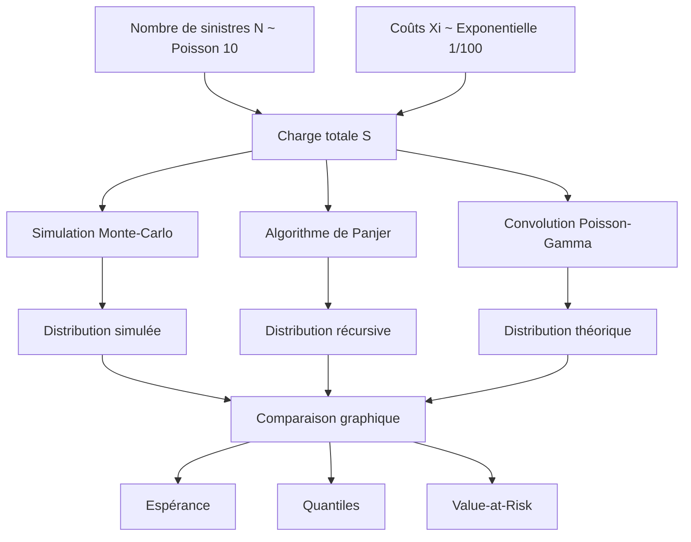

# Modélisation actuarielle de la charge agrégée de sinistres


Projet académique d’actuariat consacré à la modélisation de la charge totale des sinistres d’un contrat ou d’un portefeuille d’assurance.

Le projet repose sur un modèle collectif dans lequel :

- le nombre de sinistres est aléatoire ;
- le coût de chaque sinistre est aléatoire ;
- la charge totale correspond à la somme des coûts individuels.

Trois méthodes complémentaires sont utilisées pour déterminer la distribution de la charge agrégée :

1. simulation Monte-Carlo ;
2. algorithme récursif de Panjer ;
3. convolution théorique Poisson-Gamma.

Les résultats sont ensuite comparés à travers :

- les densités ;
- l’espérance ;
- un quantile inférieur ;
- une Value-at-Risk.

> Projet réalisé par Benjamin Baillet et Yannick Djeigo dans le cadre du Master IREF — Finance Quantitative et Actuariat de l’Université de Bordeaux.

---

## Sommaire

- [Contexte](#contexte)
- [Problématique](#problématique)
- [Objectifs](#objectifs)
- [Modèle collectif](#modèle-collectif)
- [Loi du nombre de sinistres](#loi-du-nombre-de-sinistres)
- [Loi du coût individuel](#loi-du-coût-individuel)
- [Charge agrégée](#charge-agrégée)
- [Distribution théorique de S](#distribution-théorique-de-s)
- [Méthode 1 — Simulation Monte-Carlo](#méthode-1--simulation-monte-carlo)
- [Méthode 2 — Algorithme de Panjer](#méthode-2--algorithme-de-panjer)
- [Méthode 3 — Convolution](#méthode-3--convolution)
- [Comparaison des distributions](#comparaison-des-distributions)
- [Espérance](#espérance)
- [Quantile à 5 %](#quantile-à-5-)
- [Value-at-Risk](#value-at-risk)
- [Résultats principaux](#résultats-principaux)
- [Interprétation actuarielle](#interprétation-actuarielle)
- [Structure du dépôt](#structure-du-dépôt)
- [Exécuter le projet](#exécuter-le-projet)
- [Technologies utilisées](#technologies-utilisées)
- [Compétences démontrées](#compétences-démontrées)
- [Limites](#limites)
- [Pistes d’amélioration](#pistes-damélioration)
- [Auteurs](#auteurs)

---

# Contexte

En assurance, le coût total des sinistres sur une période dépend de deux phénomènes aléatoires :

1. le nombre de sinistres observés ;
2. le coût individuel de chaque sinistre.

Même si le coût moyen d’un sinistre et le nombre moyen de sinistres sont connus, le montant total à payer reste incertain.

Cette incertitude doit être étudiée afin de permettre notamment :

- la tarification des contrats ;
- le calcul des provisions ;
- la mesure du risque ;
- le calcul du capital économique ;
- l’évaluation des pertes extrêmes ;
- le pilotage d’un portefeuille d’assurance.

---

# Problématique

Le projet répond à la question suivante :

> Comment déterminer et valider la distribution de la charge totale des sinistres lorsque le nombre de sinistres suit une loi de Poisson et que les coûts individuels suivent une loi exponentielle ?

L’étude cherche également à vérifier si différentes méthodes numériques et analytiques conduisent à des résultats cohérents.

---

# Objectifs

Les objectifs du projet sont :

1. formaliser le modèle collectif de risque ;
2. déterminer la distribution théorique de la charge agrégée ;
3. simuler la distribution avec une méthode Monte-Carlo ;
4. calculer la distribution avec l’algorithme de Panjer ;
5. calculer la distribution par convolution ;
6. comparer graphiquement les trois approches ;
7. calculer l’espérance de la charge ;
8. calculer un quantile à 5 % ;
9. calculer une Value-at-Risk ;
10. analyser les écarts entre les méthodes.

---

# Modèle collectif

La charge agrégée est définie par :

```math
S = \sum_{i=1}^{N} X_i
```

avec :

- \(N\) : nombre de sinistres ;
- \(X_i\) : coût du sinistre \(i\) ;
- \(S\) : coût total des sinistres.

Les coûts individuels sont supposés :

- indépendants ;
- identiquement distribués ;
- indépendants du nombre de sinistres.

Lorsque :

```text
N = 0
```

la charge totale vaut :

```text
S = 0
```

---

# Loi du nombre de sinistres

Le nombre de sinistres suit une loi de Poisson :

```math
N \sim \mathcal{P}(\lambda_1)
```

avec :

```text
λ₁ = 10
```

La fonction de probabilité est :

```math
P(N=k)
=
\frac{10^k e^{-10}}{k!}
```

pour :

```math
k ∈ ℕ
```

L’espérance du nombre de sinistres est :

```math
E(N) = 10
```

Le portefeuille subit donc en moyenne dix sinistres par période.

---

# Loi du coût individuel

Chaque coût individuel suit une loi exponentielle :

```math
X_i \sim \mathcal{E}(\lambda_2)
```

avec :

```text
λ₂ = 1/100
```

La densité est :

```math
f_X(x)
=
\frac{1}{100}
e^{-x/100}
```

pour :

```math
x ≥ 0
```

L’espérance du coût individuel est :

```math
E(X) = 100
```

---

# Charge agrégée

Conditionnellement à :

```text
N = n
```

la charge correspond à une somme de `n` variables exponentielles indépendantes.

Elle suit donc une loi Gamma :

```math
S \mid N=n
\sim
\Gamma(n,\lambda_2)
```

Le modèle complet est une distribution composée :

```text
Poisson-Exponentielle
```

ou, conditionnellement à `N` :

```text
mélange Poisson-Gamma
```

---

# Distribution théorique de S

La distribution de `S` comporte une masse en zéro :

```math
P(S=0)
=
P(N=0)
=
e^{-10}
```

Pour :

```text
s > 0
```

la densité est obtenue en sommant les densités Gamma pondérées par les probabilités de la loi de Poisson :

```math
f_S(s)
=
\sum_{k=1}^{+\infty}
P(N=k)
f_{\Gamma(k,\lambda_2)}(s)
```

Soit :

```math
f_S(s)
=
e^{-10}e^{-s/100}
\sum_{k=1}^{+\infty}
\frac{
(0.1)^k s^{k-1}
}{
k!(k-1)!
}
```

pour :

```text
s > 0
```

La distribution finale est donc :

```math
f_S(s)
=
\begin{cases}
e^{-10}, & s=0,\\
e^{-10}e^{-s/100}
\displaystyle\sum_{k=1}^{+\infty}
\frac{(0.1)^k s^{k-1}}
{k!(k-1)!},
& s>0.
\end{cases}
```

---

# Architecture du projet



---

# Méthode 1 — Simulation Monte-Carlo

## Principe

La simulation Monte-Carlo reproduit un grand nombre de scénarios possibles.

Pour chaque scénario :

1. simuler un nombre de sinistres `N` ;
2. simuler `N` coûts individuels ;
3. additionner les coûts ;
4. enregistrer la charge totale `S`.

## Nombre de simulations

```text
10 000 répétitions
```

## Code principal

```r
nombre_repetitions <- 10000

N <- rpois(
  nombre_repetitions,
  lambda = 10
)

S_sim <- sapply(
  N,
  function(n) {
    sum(
      rexp(
        n,
        rate = 1 / 100
      )
    )
  }
)
```

## Visualisation

La distribution simulée est étudiée avec :

- un histogramme ;
- une estimation de densité ;
- une comparaison avec les méthodes numériques.

```r
densite_sim <- density(
  S_sim,
  from = 0
)
```

La densité obtenue est asymétrique à droite.

La plupart des charges se concentrent autour de valeurs proches de 1 000, tandis qu’une queue prolongée représente les scénarios de forte sinistralité.

---

# Méthode 2 — Algorithme de Panjer

## Principe

L’algorithme de Panjer permet de calculer récursivement la distribution d’une somme composée.

Il s’applique lorsque la loi de fréquence appartient à la classe :

```text
Panjer (a,b,0)
```

Pour une loi de Poisson :

```text
a = 0
b = λ₁ = 10
```

La relation générale est :

```math
p_k
=
\left(
a+\frac{b}{k}
\right)
p_{k-1}
```

## Discrétisation

La loi exponentielle est continue.

Elle doit donc être discrétisée afin de pouvoir appliquer la récursion de Panjer.

Le calcul est réalisé sur une grille comprise entre :

```text
0 et 4 000
```

avec :

```text
10 001 points
```

## Mémoïsation

Le programme utilise une liste de mémorisation :

```r
memo <- list()
```

Chaque résultat déjà calculé est stocké afin d’éviter de refaire plusieurs fois le même calcul récursif.

Cette méthode réduit le coût de calcul de l’algorithme.

## Fonction principale

```r
panjer_S <- function(s) {

  lambda1 <- 10
  lambda2 <- 1 / 100

  if (s <= 0) {
    return(
      sum(
        0^(0:300) *
        dpois(
          0:300,
          lambda = lambda1
        )
      )
    )
  }

  s <- as.integer(
    floor(s) + 1
  )

  if (length(memo) >= s) {
    return(
      memo[[s]]
    )
  }

  rj <- sum(
    (
      lambda1 *
      (1:s) / s
    ) *
    (
      pexp(
        1:s,
        lambda2
      ) -
      pexp(
        0:(s - 1),
        lambda2
      )
    ) *
    sapply(
      1:s,
      function(i) {
        panjer_S(
          s - i - 0.5
        )
      }
    )
  )

  memo[[s]] <<- rj

  return(rj)
}
```

---

# Méthode 3 — Convolution

## Principe

Conditionnellement à `N = n`, la somme des coûts suit une loi Gamma.

La densité de `S` est donc calculée en sommant les densités Gamma pondérées par la probabilité de chaque valeur de `N`.

```r
f_S <- function(s) {

  if (s > 0) {

    n <- 500

    return(
      sum(
        dpois(
          1:n,
          lambda = 10
        ) *
        dgamma(
          s,
          shape = 1:n,
          rate = 1 / 100
        )
      )
    )

  } else {

    return(
      exp(-10)
    )
  }
}
```

La somme est tronquée à :

```text
n = 500
```

Les probabilités correspondant à des nombres de sinistres supérieurs sont considérées comme négligeables dans le cadre du calcul.

---

# Comparaison des distributions

Les trois densités sont représentées sur un même graphique :

- simulation Monte-Carlo ;
- algorithme de Panjer ;
- convolution.

Les courbes obtenues se superposent presque entièrement.

Cette proximité montre que :

- la simulation reproduit correctement la distribution ;
- la discrétisation utilisée dans Panjer reste cohérente ;
- la convolution fournit une référence théorique compatible ;
- les trois méthodes conduisent au même ordre de grandeur.

Les petits écarts peuvent provenir :

- de l’aléa de simulation ;
- du nombre limité de scénarios ;
- de la discrétisation ;
- de la troncature de la somme ;
- de l’intégration numérique.

---

# Espérance

## Formule théorique

Dans un modèle collectif :

```math
E(S)
=
E(N) \times E(X)
```

Donc :

```math
E(S)
=
10 \times 100
=
1\,000
```

## Résultat par simulation

```text
995,7616
```

## Résultat théorique ou Panjer

```text
1 000
```

## Écart relatif

L’écart est inférieur à :

```text
0,5 %
```

La simulation est donc très proche de la valeur théorique.

## Méthode des rectangles

Une estimation numérique par intégration donne également :

| Méthode | Espérance |
|---|---:|
| Simulation par densité | 1 007,036 |
| Panjer par densité | 1 004,397 |

Ces valeurs restent proches de l’espérance théorique de 1 000.

---

# Quantile à 5 %

Le quantile d’ordre 0,05 est la valeur en dessous de laquelle se situent environ 5 % des charges possibles.

## Résultats

| Méthode | Quantile à 5 % |
|---|---:|
| Simulation | 360,303 |
| Panjer | 362,4 |

L’écart entre les deux méthodes est faible.

Cette proximité confirme la cohérence des distributions dans la partie basse.

---

# Value-at-Risk

Dans le projet, la VaR associée à une queue de 5 % est déterminée à partir du quantile d’ordre 0,95.

Elle représente un niveau de charge élevé qui ne devrait être dépassé que dans environ 5 % des scénarios.

## Résultats

| Méthode | VaR |
|---|---:|
| Simulation | 1 788,22 |
| Panjer | 1 818,8 |

Les valeurs restent proches et conduisent au même ordre de grandeur pour la charge extrême à couvrir.

---

# Résultats principaux

| Indicateur | Simulation | Panjer ou théorie |
|---|---:|---:|
| Espérance de `S` | 995,76 | 1 000 |
| Quantile à 5 % | 360,30 | 362,40 |
| VaR — queue de 5 % | 1 788,22 | 1 818,80 |

Les principaux enseignements sont :

- l’espérance simulée est très proche de l’espérance théorique ;
- les quantiles inférieurs sont cohérents ;
- les VaR sont du même ordre de grandeur ;
- les trois densités sont presque superposées ;
- les approximations numériques restent limitées.

---

# Interprétation actuarielle

## Espérance

L’espérance représente le coût moyen attendu du portefeuille :

```text
Environ 1 000 unités monétaires
```

Elle peut servir de première base pour :

- la prime pure ;
- le provisionnement moyen ;
- la comparaison de portefeuilles.

## Quantile à 5 %

Le quantile inférieur décrit les scénarios de faible sinistralité.

Il indique qu’environ 5 % des charges sont inférieures à une valeur proche de :

```text
360
```

## Value-at-Risk

La VaR décrit un scénario de charge élevée.

Une valeur proche de :

```text
1 800
```

signifie qu’environ 95 % des charges restent inférieures à ce montant dans le cadre du modèle retenu.

Elle peut contribuer à :

- calculer une marge de sécurité ;
- estimer un capital économique ;
- définir une limite de risque ;
- dimensionner une couverture.

---

# Structure du dépôt

```text
modelisation-charge-sinistres-actuariat/
│
├── README.md
│
├── code/
│   └── Projet actuariat.Rmd
│
├── documentation/
│   ├── Projet-actuariat.pdf
│   └── Synthese_Actuariat.pdf
```

---

# Exécuter le projet

Le fichier publié correspond au livrable original du projet.

Aucun jeu de données externe n’est nécessaire.

Toutes les observations sont générées directement dans le code avec :

```r
rpois()
rexp()
```

## Prérequis

- R ;
- RStudio ;
- R Markdown ;
- LaTeX ou Pandoc pour produire le PDF.

## Ouvrir le projet

Dans RStudio, ouvrir :

```text
Projet actuariat.Rmd
```

Puis cliquer sur :

```text
Knit
```

ou exécuter les blocs de code dans leur ordre d’origine.

Aucune modification du code n’est nécessaire.

---

# Reproductibilité

La simulation Monte-Carlo repose sur des nombres aléatoires.

Les résultats peuvent donc varier légèrement à chaque exécution.

Pour reproduire exactement les mêmes scénarios, il serait possible d’ajouter :

```r
set.seed(42)
```

Cette ligne n’est toutefois pas indispensable pour consulter ou présenter le projet original.

---

# Technologies utilisées

## R

Utilisé pour :

- simuler les distributions ;
- programmer la récursion ;
- calculer les indicateurs ;
- produire les graphiques.

## R Markdown

Utilisé pour réunir :

- les démonstrations ;
- les équations ;
- le code ;
- les graphiques ;
- les résultats ;
- les interprétations.

## Monte-Carlo

Utilisé pour obtenir une approximation empirique de la distribution de la charge.

## Algorithme de Panjer

Utilisé pour calculer récursivement une approximation de la distribution agrégée.

## Lois de probabilité

Le projet mobilise :

- loi de Poisson ;
- loi exponentielle ;
- loi Gamma ;
- distribution composée.

---

# Compétences démontrées

## Actuariat

- modèle collectif de risque ;
- fréquence des sinistres ;
- sévérité ;
- charge agrégée ;
- quantiles ;
- Value-at-Risk ;
- provisionnement.

## Probabilités

- loi de Poisson ;
- loi exponentielle ;
- loi Gamma ;
- espérance conditionnelle ;
- mélanges de distributions ;
- convolution.

## Programmation R

- simulation ;
- fonctions ;
- boucles ;
- récursivité ;
- mémoïsation ;
- vectorisation ;
- graphiques.

## Calcul numérique

- discrétisation ;
- intégration approchée ;
- troncature ;
- calcul récursif ;
- approximation de densité.

## Analyse du risque

- espérance ;
- quantiles ;
- VaR ;
- comparaison de méthodes ;
- validation numérique.

## Communication

- rédaction mathématique ;
- documentation du code ;
- graphiques comparatifs ;
- synthèse des résultats ;
- interprétation métier.

---

# Limites

- Les données sont entièrement simulées.
- Les paramètres sont fixés arbitrairement.
- La fréquence est supposée suivre une loi de Poisson.
- Les coûts suivent une loi exponentielle.
- L’indépendance entre fréquence et sévérité est supposée.
- Les coûts individuels sont supposés indépendants et identiquement distribués.
- La loi exponentielle possède une queue relativement légère.
- La récursion de Panjer nécessite une discrétisation.
- La somme de convolution est tronquée.
- Le calcul porte sur une grille limitée à 4 000.
- Les résultats de simulation varient à chaque exécution.
- La VaR ne renseigne pas sur le montant moyen des pertes au-delà du quantile.
- Le projet ne traite pas l’inflation ou l’évolution temporelle des coûts.
- Le modèle ne prend pas en compte la réassurance.

---

# Pistes d’amélioration

- utiliser des données réelles de sinistres ;
- estimer les paramètres à partir des données ;
- tester une loi lognormale ;
- tester une loi Pareto ;
- tester une loi Gamma pour les sévérités ;
- utiliser une loi binomiale négative pour la fréquence ;
- mesurer l’Expected Shortfall ;
- calculer la variance de la charge ;
- calculer le coefficient de variation ;
- augmenter le nombre de simulations ;
- construire des intervalles de confiance ;
- analyser l’erreur de discrétisation ;
- comparer différents pas de grille ;
- intégrer une franchise ;
- intégrer un plafond ;
- modéliser un traité de réassurance ;
- comparer plusieurs portefeuilles ;
- créer une application interactive.

---

# Conclusion

Ce projet met en œuvre une chaîne complète de modélisation actuarielle :

```text
Hypothèses probabilistes
          ↓
Distribution composée
          ↓
Simulation Monte-Carlo
          ↓
Algorithme de Panjer
          ↓
Convolution théorique
          ↓
Comparaison des densités
          ↓
Calcul des indicateurs de risque
```

Les trois méthodes fournissent des distributions presque identiques.

La proximité entre :

- l’espérance simulée et l’espérance théorique ;
- les quantiles ;
- les Value-at-Risk ;

confirme la cohérence de la modélisation.

La simulation apporte de la flexibilité.

L’algorithme de Panjer fournit une approche récursive efficace.

La convolution constitue une référence théorique.

L’utilisation conjointe de ces méthodes forme une démarche de validation solide pour l’analyse d’un risque agrégé.

---

# Auteurs

Projet réalisé par :

- Benjamin Baillet ;
- Yannick Djeigo.

Établissement :

```text
Université de Bordeaux
Master IREF — Finance Quantitative et Actuariat
```

## Benjamin Baillet

Compétences principales :

- R ;
- actuariat ;
- probabilités ;
- simulation Monte-Carlo ;
- analyse du risque ;
- Python ;
- SQL ;
- Power BI.
